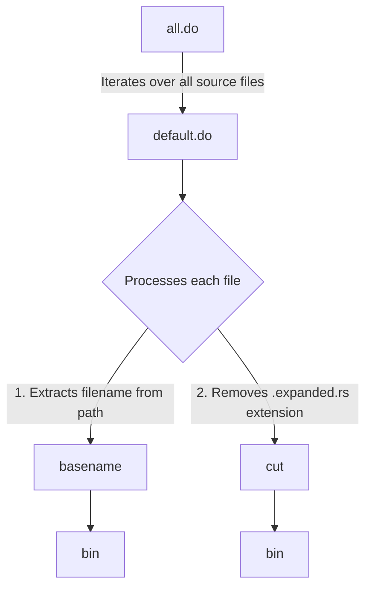

# `test-virtual`

This is an example virtual-workspace that contains crates:

- `wrkspc`
- `wrkspc-dev`
- `wrkspc-macro`
- `wrkspc-test`

Where:

- `wrkspc`: A "Hello world" style library (for release as a crate).
- `wrkspc-dev`: A "Hello world" style library for development (not for release).
- `wrkspc-macro`: The `test-promacro-project` adjusted to fit into the workspace plugin-test harness. This crate provides a declarative `test_vec![]` macro
to test its expansion under the [tests](tests) directory with [`macrostest`](https://crates.io/crates/macrotest).
- `wrkspc-test`: The `test-project` adjusted to fit into the workspace integrated test harness.

The integration test harness, `wkspc-test`, uses [DJB's redo build system](https://cr.yp.to/redo.html), as implemented by [apenwarr](https://github.com/apenwarr/redo/) and as ported to Rust by [zombiezen](https://github.com/zombiezen/redo-rs).

In this build process `all.do` flows to a generic build step `default.do`. Hence, `all.do` is responsible for iterating over all source files and `default.do` is responsible for processing each individual file. The `default.do` is kept generic by adhering to some naming conventions, shared between the macro and test crates:

In this setup:

- `all.do` is the starting point of the build process.
- `default.do` is called by `all.do` for each source file.
- `default.do` processes each file by:
  - Extracting the filename from the path using `basename`, resulting in `bin`.
  - Removing the `.expanded.rs` extension using `cut`, resulting in `bin`.

Please note that this is a simplified diagram and the actual build process may involve more steps.



## Containers

To run Testcontainers-based tests,
you need a Docker-API compatible container runtime,
such as using [Testcontainers Cloud](https://www.testcontainers.cloud/) or installing [Podman](https://podman.io/)  or Docker locally.  [Testcontainers Desktop](https://testcontainers.com/desktop/) takes care of most of the manual configuration for alternative runtimes. See [Customizing Docker host detection](#customizing-docker-host-detection) for general configuration mechanisms.

### Podman

In order to run testcontainers against [podman](https://podman.io/) the env vars bellow should be set

MacOS:

```bash

export DOCKER_HOST=unix://$(podman machine inspect --format '{{.ConnectionInfo.PodmanSocket.Path}}')
export TESTCONTAINERS_DOCKER_SOCKET_OVERRIDE=/var/run/docker.sock

```

Linux:

```bash
export DOCKER_HOST=unix://${XDG_RUNTIME_DIR}/podman/podman.sock
```

If you're running Podman in rootless mode, ensure to include the following line to disable Ryuk:

```bash
export TESTCONTAINERS_RYUK_DISABLED=true
```

!!! note
    Previous to version 1.19.0, `export TESTCONTAINERS_RYUK_PRIVILEGED=true`
    was required for rootful mode. Starting with 1.19.0, this is no longer required.

### Container environment discovery

Testcontainers will try to connect to a Docker daemon using the following strategies in order:

- Environment variables:
  - `DOCKER_HOST`
  - `DOCKER_TLS_VERIFY`
  - `DOCKER_CERT_PATH`
- Defaults:
  - `DOCKER_HOST=https://localhost:2376`
  - `DOCKER_TLS_VERIFY=1`
  - `DOCKER_CERT_PATH=~/.docker`
- If Docker Machine is installed, the docker machine environment for the *first* machine found. Docker Machine needs to be on the PATH for this to succeed.
- If you're going to run your tests inside a container, please read [Patterns for running tests inside a docker container](continuous_integration/dind_patterns.md) first.

### Docker registry authentication

Testcontainers will try to authenticate to registries with supplied config using the following strategies in order:

- Environment variables:
  - `DOCKER_AUTH_CONFIG`
- Docker config
  - At location specified in `DOCKER_CONFIG` or at `{HOME}/.docker/config.json`

### Customizing Docker host detection
